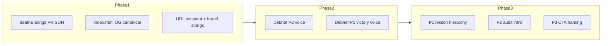

# Plan: Address consensus debrief / funnel issues

## Scope boundaries

- **In scope:** Copy, static HTML meta, small UI hierarchy/microcopy, one new asset (`og:image`), shared URL constant, test updates for changed strings.
- **Out of scope (unless you explicitly expand later):** SSR/prerender for per-outcome OG tags (planning docs in [.planning/phases/14-situational-outcome-imagery/](.planning/phases/14-situational-outcome-imagery/) already note this is a larger lift); full audit-page collapsible UI.

## Phase 1 — Safety, brand, and SEO “vinyl layer”

### 1.1 Prison ending title (sensitivity + tone consistency)

- Edit [`src/data/deathEndings.ts`](src/data/deathEndings.ts): replace the **PRISON** `title` (and keep description edgy without the Office Space sexual-innuendo punchline).
- Update assertions that hardcode the old title:
  - [`tests/image-collapse-page.spec.ts`](tests/image-collapse-page.spec.ts) (regex + `alt` expectation).
- Re-run relevant Playwright/visual tests that touch PRISON if any snapshot names reference the string (see [`tests/screenshots/phase06-verification/INDEX.md`](tests/screenshots/phase06-verification/INDEX.md) — documentation only unless screenshots key on text).

### 1.2 Static Open Graph + canonical (reliable previews)

- Edit [`index.html`](index.html):
  - Add **`og:image`** (absolute URL to a new asset under `public/`, e.g. `public/og-default.png`, **1200×630** recommended).
  - Add **`og:url`** placeholder (same origin; can mirror final deploy URL or use relative strategy per your hosting — Vercel typically serves one canonical host).
  - Add **`link rel="canonical"`** aligned with production domain.
  - Optionally add **`twitter:card`** + **`twitter:image`** for parity.
- **Asset:** Create or export one branded default image (title + subtitle: “K-Maru — AI No-Win Scenario Simulator”). No code can invent the bitmap; plan assumes you add the file to `public/`.

### 1.3 Meta description keywords (consensus Tier C)

- Extend [`index.html`](index.html) `description` / `og:description` to include **free**, **no signup**, and **game** (or “swipe game”) without bloating past ~155–160 chars — one editorial pass.

### 1.4 Single source of truth for public game URL

- Introduce e.g. `VITE_PUBLIC_GAME_URL` in [`.env.example`](.env.example) (documented) and read it in [`src/utils/linkedin-share.ts`](src/utils/linkedin-share.ts) + [`src/components/game/debrief/DebriefPage3Verdict.tsx`](src/components/game/debrief/DebriefPage3Verdict.tsx) (`KIRK_SHARE_TEXT` fallback) so **localhost vs production** and **future domain moves** do not require string hunting.
- Default fallback can remain the current production URL for backwards compatibility.
- Update [`unit/linkedin-share.test.ts`](unit/linkedin-share.test.ts) to match.

### 1.5 Brand vocabulary alignment (K-Maru vs Kobayashi Maru)

- **Decision baked into plan:** Lead with **K-Maru** in share titles and first line; treat “Kobayashi Maru” as **optional secondary** metaphor in body copy (one phrase), not competing product names in `og:title` / `getShareUrl` title.
- Files to align:
  - [`src/utils/linkedin-share.ts`](src/utils/linkedin-share.ts) — `formatShareText`, `getShareUrl` `title` param.
  - [`src/components/game/debrief/DebriefPage3Verdict.tsx`](src/components/game/debrief/DebriefPage3Verdict.tsx) — `updateMetaTags` `og:title` / `og:description` strings; `KIRK_SHARE_TEXT` URL + wording.
- Keep voice; avoid diluting the joke — just **one spine** for “what is this product called?”

### 1.6 Client-side `og:url` injection

- [`DebriefPage3Verdict.tsx`](src/components/game/debrief/DebriefPage3Verdict.tsx) already updates `og:url` if the node exists — **add the matching `<meta property="og:url" …>` in `index.html`** so runtime updates actually apply (fixes the dead branch noted in review).

---

## Phase 2 — Voice: intro promise vs debrief payoff

### 2.1 Replace “museum label” on Debrief page 2

- [`src/components/game/debrief/DebriefPage2AuditTrail.tsx`](src/components/game/debrief/DebriefPage2AuditTrail.tsx): rewrite the amber micro-line (*“Consider how different choices…”*) to match **terminal / governance-roast** voice (still a reflection prompt, not HR filler).

### 2.2 Victory block in Debrief page 1

- [`src/components/game/debrief/DebriefPage1Collapse.tsx`](src/components/game/debrief/DebriefPage1Collapse.tsx): tighten **“Why you survived”** and the explanatory paragraph so they read like **the same author** as [`IntroScreen.tsx`](src/components/game/IntroScreen.tsx) — cynical-but-literate, not generic LMS copy. Keep facts; change register.

### 2.3 Optional one-line bridge (selection screens)

- If still feeling “American shell / British narrator” without signaling: add **one** short line on [`PersonalitySelect.tsx`](src/components/game/PersonalitySelect.tsx) header subcopy (e.g. narrator accent vs UI locale) — only if 2.1–2.2 aren’t enough.

---

## Phase 3 — Cognitive load: P1, P2, P3

### 3.1 Debrief page 1 — hierarchy

- [`DebriefPage1Collapse.tsx`](src/components/game/debrief/DebriefPage1Collapse.tsx): reorder or visually **group** so **Failure lesson** (when present) sits closer to the emotional headline than the endings trophy grid, **or** add a single **“Takeaway”** line above the lesson card (derive from `failureLesson.title` — no new data). Goal: one pedagogical anchor before collectibles.

### 3.2 Debrief page 2 — entry compression (copy-only)

- Same file / [`DebriefPage2AuditTrail.tsx`](src/components/game/debrief/DebriefPage2AuditTrail.tsx): add a **2–3 sentence voicey intro** under the audit header summarizing *what this page is for* (“forensic replay,” “where you signed the violation”) — reduces “FOIA dump” shock without collapsible UI.

### 3.3 Debrief page 3 — CTA clarity

- [`DebriefPage3Verdict.tsx`](src/components/game/debrief/DebriefPage3Verdict.tsx):
  - Add short helper text: **Copy first** is the reliable path for a full post; LinkedIn opens the composer with **site preview** (honest framing per [`linkedin-share.ts`](src/utils/linkedin-share.ts) comments).
  - Demote visual weight of **V2 DM** vs **Share** (e.g. secondary styling or lower placement) so **one primary** post-run action reads clearly — exact treatment follows existing [`BTN_DEBRIEF_NAV`](src/lib/buttonStyles.ts) patterns.

### 3.4 Shorter default share body (optional A/B hypothesis)

- [`linkedin-share.ts`](src/utils/linkedin-share.ts): offer a **tighter** `formatShareText` (Kirk-length discipline) — fewer paragraphs, same URL and NOTICE — to improve “paste and post” rate. Keep a comment that long form was the previous behavior if you want to revert.

---

## Phase 4 — Team mode + editorial hygiene

### 4.1 Team mode with a door

- [`IntroScreen.tsx`](src/components/game/IntroScreen.tsx): add **“Copy game link”** (uses `navigator.clipboard.writeText` with `window.location.origin` + path, or full canonical URL from `VITE_PUBLIC_GAME_URL` + `location.pathname`) next to or below the Team Mode blurb — fulfills “forward” with a concrete step.

### 4.2 Date-range typography

- [`src/data/failureLessons.ts`](src/data/failureLessons.ts): normalize year spans to match intro **en-dash** style (`2024–2025` not `2024-2025`) for editorial consistency.

---

## Verification

| Layer | Command |
|--------|---------|
| Types | `bun run typecheck` |
| Lint | `bun run check` on touched files |
| Unit | `bun run test:unit` (linkedin-share tests) |
| E2E | `bun run test:smoke` + targeted specs: `image-collapse-page.spec.ts` if changed |

---

## Exact before / after (planned edits)

Concrete strings and structure below are the **implementation target**; tweak tone in PR if something reads flat, but this is the full diff-style spec.

### 1.1 [`src/data/deathEndings.ts`](src/data/deathEndings.ts) — `PRISON`

**Before**

```ts
[DeathType.PRISON]: {
	title: "Federal pound-me-in-the-ass prison",
	description:
		"The auditors found your search history AND the offshore accounts. Federal raid in progress. Orange is the new black.",
```

**After**

```ts
[DeathType.PRISON]: {
	title: "Federal indictment (jumpsuit included)",
	description:
		"The auditors found your search history AND the offshore accounts. Federal raid in progress. Orange is not a branding choice.",
```

### 1.2–1.3–1.6 [`index.html`](index.html) head (append / replace)

**Before** (lines 11–14 area — no `og:image`, no `og:url`, no `canonical`)

```html
<title>K-Maru — AI No-Win Scenario Simulator</title>
<meta property="og:title" content="K-Maru — AI No-Win Scenario Simulator" />
<meta property="og:description" content="Every AI decision you make will blow up in your face. Swipe through impossible workplace AI dilemmas. Based on actual 2024–25 incidents. Made for people who hate boring compliance training." />
<meta name="description" content="Every AI decision you make will blow up in your face. Swipe through impossible workplace AI dilemmas. Based on actual 2024–25 incidents. Made for people who hate boring compliance training.">
```

**After** (same title; expanded description; add tags — use **one** canonical base URL aligned with production, e.g. `https://k-maru-seven.vercel.app` until `VITE_PUBLIC_GAME_URL` is mirrored at build time or documented)

```html
<link rel="canonical" href="https://k-maru-seven.vercel.app/" />
<meta property="og:url" content="https://k-maru-seven.vercel.app/" />
<meta property="og:image" content="https://k-maru-seven.vercel.app/og-default.png" />
<meta property="og:image:width" content="1200" />
<meta property="og:image:height" content="630" />
<meta name="twitter:card" content="summary_large_image" />
<meta name="twitter:image" content="https://k-maru-seven.vercel.app/og-default.png" />
```

**Meta description / og:description — Before**

`Every AI decision you make will blow up in your face. Swipe through impossible workplace AI dilemmas. Based on actual 2024–25 incidents. Made for people who hate boring compliance training.`

**Meta description / og:description — After** (target ~155–175 chars; trim if needed)

`Free swipe game, no signup. Every AI decision blows up in your face—workplace dilemmas from real 2024–25 incidents. For people who hate boring compliance training.`

**Asset:** add file `public/og-default.png` (1200×630). `og:image` **must** use absolute URL in production; path above assumes that file exists.

### 1.4 Public URL helper + env

**New** (e.g. [`src/lib/publicGameUrl.ts`](src/lib/publicGameUrl.ts) or inline in [`linkedin-share.ts`](src/utils/linkedin-share.ts)):

```ts
export function getPublicGameUrl(): string {
	const raw = import.meta.env.VITE_PUBLIC_GAME_URL as string | undefined
	return (raw?.replace(/\/$/, "") || "https://k-maru-seven.vercel.app")
}
```

**[`/.env.example`](.env.example) — append**

```env
# Canonical site URL for share links (no trailing slash). Optional; defaults to production host.
# VITE_PUBLIC_GAME_URL=https://k-maru-seven.vercel.app
```

**[`vitest.config.ts`](vitest.config.ts) `define` — add** so unit tests don’t depend on `.env`:

```ts
"import.meta.env.VITE_PUBLIC_GAME_URL": JSON.stringify("https://k-maru-seven.vercel.app"),
```

**[`src/utils/linkedin-share.ts`](src/utils/linkedin-share.ts) — Before** (`formatShareText` default URL)

```ts
const url = gameUrl ?? "https://k-maru-seven.vercel.app/";
```

**After**

```ts
const url = gameUrl ?? `${getPublicGameUrl()}/`;
```

(same pattern anywhere else that hardcodes the vercel URL)

### 1.5 Brand spine — share text, titles, meta

**[`src/utils/linkedin-share.ts`](src/utils/linkedin-share.ts) `formatShareText` — Before**

```ts
return `I just faced the AI Kobayashi Maru as a ${roleTitle}.

My Resilience Score: ${clampedResilience}% (${archetypeName}). Can you beat my score?

Try the No-Win Simulation and swipe your way through the AI Singularity.

It's not about passing; it's about discovering who you are when the system collapses.

[NOTICE: Made for people who hate f*cking boring training]

${url}`;
```

**After** (K-Maru first; Kobayashi optional one-liner; shorter body)

```ts
return `I just finished K-Maru as a ${roleTitle} — the AI no-win swipe game (Kobayashi energy, corporate liability).

Resilience: ${clampedResilience}% (${archetypeName}). Beat my score?

${url}

[NOTICE: Made for people who hate f*cking boring training]`;
```

**`getShareUrl` — Before**

```ts
const title = `Kobayashi Maru - ${archetype.name} Archetype`;
```

**After**

```ts
const title = `K-Maru — ${archetype.name}`;
```

**[`DebriefPage3Verdict.tsx`](src/components/game/debrief/DebriefPage3Verdict.tsx) `updateMetaTags` — Before**

```ts
const ogTitle = `K-Maru - ${archetype.name}${roleLabel} • ${resilience}% Resilience`;
// ...
const ogDesc = `I faced the Kobayashi Maru as a ${role || "leader"} and discovered my leadership archetype. Can you beat my score?`;
```

**After**

```ts
const ogTitle = `K-Maru — ${archetype.name}${roleLabel} • ${resilience}% resilience`;
const ogDesc = `I finished K-Maru as a ${role || "leader"} and got an archetype + resilience score. Can you beat it?`;
```

**`KIRK_SHARE_TEXT` — Before**

```ts
const KIRK_SHARE_TEXT =
	"I broke the Kobayashi Maru. There was always a third option. Kirk would be proud.\n\nhttps://k-maru-seven.vercel.app/";
```

**After** (use `getPublicGameUrl()` in module scope or template at use site)

```ts
const KIRK_SHARE_TEXT = `I broke K-Maru’s no-win test. Third option. Kirk-coded.\n\n${getPublicGameUrl()}/`;
```

**[`unit/linkedin-share.test.ts`](unit/linkedin-share.test.ts):** replace every expected substring that references `AI Kobayashi Maru`, long middle paragraphs, and default URL — match the **After** strings above.

---

### 2.1 [`DebriefPage2AuditTrail.tsx`](src/components/game/debrief/DebriefPage2AuditTrail.tsx) — amber line + intro blurb

**Before** (reflection line only)

```tsx
<p className="mt-2 text-xs md:text-sm text-[#B8962E]/70">
	Consider how different choices might have changed the outcome
</p>
```

**After** (replace line + insert **new** block immediately under the gray subtitle, before the amber line)

Under `A complete record of your governance decisions` / Kirk warning — **insert:**

```tsx
<p className="mt-3 max-w-xl mx-auto text-left text-sm text-slate-400 leading-relaxed px-1">
	This is the paper trail: every prompt, both forks, and the violation you actually signed.
	If you’re looking for deniability, it’s not in this log.
</p>
```

**Amber line — After**

```tsx
<p className="mt-2 text-xs md:text-sm text-[#B8962E]/70">
	Replay the forks mentally: same card, other swipe — different fine, different headline.
</p>
```

---

### 2.2 [`DebriefPage1Collapse.tsx`](src/components/game/debrief/DebriefPage1Collapse.tsx) — victory “Why you survived”

**Before**

```tsx
<p className="text-xs text-slate-500 mb-2">
	Your decisions balanced risk across budget, heat, and hype — no
	single vector dominated.
</p>
<p className="text-sm text-gray-300 leading-relaxed">
	Surviving a quarter in hyperscale means managing competing
	pressures without letting any one metric spiral. You kept the
	budget sustainable, avoided regulatory heat, and maintained just
	enough hype to stay funded. That balance is the real win.
</p>
```

**After**

```tsx
<p className="text-xs text-slate-500 mb-2">
	You kept budget, heat, and hype from eating each other — no single meter ran away.
</p>
<p className="text-sm text-gray-300 leading-relaxed">
	Hyperscale is three bad incentives on one dashboard. You held an uneasy truce
	long enough to file the quarter under “still legal.” The synthetic coffee is still fake;
	the tradeoff you navigated isn’t.
</p>
```

---

### 2.3 Optional [`PersonalitySelect.tsx`](src/components/game/PersonalitySelect.tsx)

**Before** (header subcopy ends after first `<p>`)

```tsx
<p className="mt-4 md:mt-6 max-w-xl mx-auto text-slate-400 text-sm md:text-base leading-relaxed px-4">
	Pick the unhinged co-pilot that will narrate your simulation spiral,
	hype your bad ideas, and occasionally try to keep you out of prison.
	Or not.
</p>
```

**After** (append second line)

```tsx
<p className="mt-2 max-w-xl mx-auto text-slate-500 text-xs md:text-sm px-4 text-center">
	Narrator accents are flavor; the scenarios are US tech satire. That mismatch is on purpose.
</p>
```

---

### 3.1 [`DebriefPage1Collapse.tsx`](src/components/game/debrief/DebriefPage1Collapse.tsx) — failure path order

**Before** (excerpt `regularDeathType` chain)

```tsx
{deathEnding && regularDeathType && (
	<DeathEndingCard ... />
)}
{regularDeathType && explanation && (
	<ExplanationCard explanation={explanation} />
)}
{(isKirk || regularDeathType) && failureLesson && (
	<FailureLessonCard lesson={failureLesson} />
)}
```

**After** (swap **ExplanationCard** and **FailureLessonCard** for `regularDeathType` runs so the lesson sits directly under the ending card, before the vector explanation)

```tsx
{deathEnding && regularDeathType && (
	<DeathEndingCard ... />
)}
{(isKirk || regularDeathType) && failureLesson && (
	<FailureLessonCard lesson={failureLesson} />
)}
{regularDeathType && explanation && (
	<ExplanationCard explanation={explanation} />
)}
```

**Note:** For **Kirk-only** path, keep existing order (`explanation` before lesson) unless you unify in the same PR — if Kirk uses both, reconcile so `failureLesson` position is consistent (spec: Kirk stays: explanation → lesson as today, or mirror non-Kirk; pick one rule in implementation).

---

### 3.3 [`DebriefPage3Verdict.tsx`](src/components/game/debrief/DebriefPage3Verdict.tsx) — helper + V2 demotion

**Insert after** the subtitle `<p>` under SIMULATION COMPLETE (before Archetype Verdict) — **Before:** nothing.

**After**

```tsx
<p className="mt-3 max-w-md mx-auto text-center text-xs text-slate-500">
	Copy the post text first — LinkedIn usually shows the site’s static preview, not text from this screen.
</p>
```

**V2 block — Before** (primary cyan button)

```tsx
className="inline-flex ... bg-cyan-600 hover:bg-cyan-500 text-white ..."
```

**After** (secondary: outline / muted fill so Share rail stays visually primary)

```tsx
className="inline-flex ... border border-cyan-500/40 bg-transparent text-cyan-300 hover:bg-cyan-500/10 ..."
```

---

### 3.4 Optional shorter share body

If 1.5 **After** `formatShareText` is already short, **skip** a second variant; else the block in 1.5 is the single canonical short template.

---

### 4.1 [`IntroScreen.tsx`](src/components/game/IntroScreen.tsx) — Team mode

**Before** (Team Mode is text-only)

```tsx
<p className="max-w-xl text-slate-400 text-xs md:text-sm mb-10 md:mb-12 px-4 text-center leading-relaxed">
	[TEAM MODE: Forward this to a colleague.
	<br /> Watch them swipe the opposite way on every card.
	<br /> That's the debrief you never got from HR.]
</p>
```

**After** (add button + handler: `navigator.clipboard.writeText` with `` `${getPublicGameUrl()}${window.location.pathname || "/"}` `` or `window.location.href` in browser)

```tsx
<p className="max-w-xl text-slate-400 text-xs md:text-sm mb-3 md:mb-4 px-4 text-center leading-relaxed">
	[TEAM MODE: Forward this to a colleague.
	<br /> Watch them swipe the opposite way on every card.
	<br /> That's the debrief you never got from HR.]
</p>
<div className="flex justify-center mb-10 md:mb-12">
	<button
		type="button"
		data-testid="copy-game-link-button"
		className="px-4 py-2 text-xs font-bold border border-slate-600 text-slate-300 hover:border-cyan-500/50 hover:text-cyan-300 transition-colors"
		onClick={...copy canonical URL...}
	>
		Copy game link
	</button>
</div>
```

Intro will need `getPublicGameUrl` import or duplicate minimal URL logic consistent with Phase 1.4.

---

### 4.2 [`src/data/failureLessons.ts`](src/data/failureLessons.ts) — en-dashes in year ranges

**Before** (examples — hyphen in parentheses)

- `(2024-2025)`, `(2023-2024)`, `(2021-2024)`, `(2020-2024)`, `(2023-2025)`

**After**

- `(2024–2025)`, `(2023–2024)`, `(2021–2024)`, `(2020–2024)`, `(2023–2025)` (Unicode en-dash U+2013)

Apply to **all** `realWorldExample` strings that use a four-digit hyphen four-digit pattern in this file (grep `\\d{4}-\\d{4}`).

---

### Tests to update (exact expectations)

| File | Change |
|------|--------|
| [`tests/image-collapse-page.spec.ts`](tests/image-collapse-page.spec.ts) | Regex `/Federal pound-me-in-the-ass prison/i` → `/Federal indictment \\(jumpsuit included\\)/i` (or plain string match for new title); `alt='Ending: ...'` matches new title |
| [`unit/linkedin-share.test.ts`](unit/linkedin-share.test.ts) | All Kobayashi-first and long-paragraph expectations per 1.5 |

---

## Risk notes

- **LinkedIn previews:** Static `og:image` + `index.html` meta fixes **default** shares; **per-archetype** rich previews still require server-rendered or dedicated share URLs — out of scope unless you add a later phase.
- **Visual regression:** Prison title change may affect screenshot tests that assert visible text — update expectations in the same PR.
- **Kirk path ordering (3.1):** If swapping explanation vs lesson for non-Kirk only, document the rule in a one-line comment in `DebriefPage1Collapse.tsx` to avoid future “fix” that re-breaks narrative.


