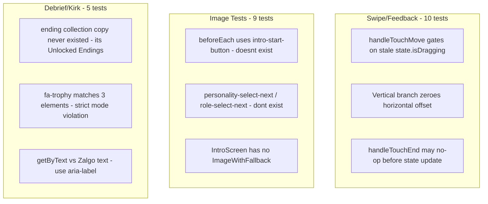

# Fix Playwright Test Failures and Slow Tests

## Root Cause Summary

The 24 failures fall into **three distinct buckets**:




---

## Bucket 1: Swipe/Feedback Tests (10 failures)

**Files**: `button-highlight`, `exit-animation`, `snap-back`, `swipe-consistency`, `swipe-interactions`

**Problem**: `handleTouchMove` and `handleTouchEnd` in [hooks/useSwipeGestures.ts](hooks/useSwipeGestures.ts) guard on `state.isDragging`, but React state updates are async. The first `mousemove` after `mousedown` can still see `isDragging === false`, so the drag pipeline never starts, `direction` stays `null`, and `onSwipe` never fires.

**Fix** (in `useSwipeGestures.ts`):

- Add `isDraggingRef = useRef(false)` set synchronously in `handleTouchStart` and cleared in `handleTouchEnd`
- Gate `handleTouchMove` and `handleTouchEnd` on `isDraggingRef.current` instead of `state.isDragging`
- Keep `state.isDragging` for render purposes only

```typescript
const isDraggingRef = useRef(false);

const handleTouchStart = useCallback((clientX, clientY) => {
  if (!enabled) return;
  isDraggingRef.current = true;  // sync
  // ... rest unchanged
}, [enabled]);

const handleTouchMove = useCallback((clientX, clientY) => {
  if (!isDraggingRef.current || !enabled) return;  // ref, not state
  // ... rest unchanged
}, [enabled]);

const handleTouchEnd = useCallback(() => {
  if (!isDraggingRef.current) return;  // ref, not state
  isDraggingRef.current = false;
  // ... rest unchanged
}, [...deps]);
```

---

## Bucket 2: Image Tests (9 failures)

**Files**: `image-cls`, `image-fallback`, `image-transitions`, `image-archetype-badge`

**Problem**: `beforeEach` blocks use selectors that don't exist:

- `data-testid="intro-start-button"` → should be `boot-system-button`
- `personality-select-next` / `role-select-next` → never existed; selection is direct personality/role buttons

**Fix**:

- Replace broken navigation with existing helpers (`navigateToPlayingFast`, `navigateToPlayingWithCardAtIndex`) or `gotoWithKmDebugState`
- For `image-fallback.spec.ts`: navigate to a route that actually mounts `ImageWithFallback` (e.g., playing with a card that has `realWorldReference.incident`)
- For `image-archetype-badge.spec.ts`: replace `text=...` OR selector with `getByRole('heading', { name: /SIMULATION (COMPLETE|HIJACKED)/ })`

**Affected files**:

- [tests/image-cls.spec.ts](tests/image-cls.spec.ts)
- [tests/image-fallback.spec.ts](tests/image-fallback.spec.ts)
- [tests/image-transitions.spec.ts](tests/image-transitions.spec.ts)
- [tests/image-archetype-badge.spec.ts](tests/image-archetype-badge.spec.ts)

---

## Bucket 3: Debrief/Kirk Tests (5 failures)

**Files**: `summary-debrief`, `kirk-easter-egg`

**Problem 1**: Tests assert `/ending collection/i` but the app says **"Unlocked Endings"** ([components/game/debrief/DebriefPage1Collapse.tsx](components/game/debrief/DebriefPage1Collapse.tsx) lines 331-336).

**Fix**: Change test assertions from `/ending collection/i` to `/unlocked endings/i`.

**Problem 2**: `.fa-trophy` matches 3 icons on victory page (1 hero + 2 flanking "Unlocked Endings"). Strict mode violation.

**Fix**: Scope the locator, e.g.:

```typescript
page.locator('h1 + .fa-trophy').first()  // hero trophy
// or
page.locator('[data-testid="victory-trophy"]')  // add testid
```

**Problem 3**: Kirk "SIMULATION BREACH" uses Zalgo text via `corruptText()`. `getByText(/simulation breach/i)` fails because the rendered string has combining marks.

**Fix**: Use accessible name (the `aria-label` is set to `"SIMULATION BREACH"`):

```typescript
page.getByRole('heading', { name: /simulation breach/i })
```

**Affected files**:

- [tests/summary-debrief.spec.ts](tests/summary-debrief.spec.ts)
- [tests/kirk-easter-egg.spec.ts](tests/kirk-easter-egg.spec.ts)
- Optionally [components/game/debrief/DebriefPage1Collapse.tsx](components/game/debrief/DebriefPage1Collapse.tsx) to add `data-testid="victory-trophy"`

---

## Top 10 Slowest Tests


| Test                                             | Duration | Cause                                              | Action                             |
| ------------------------------------------------ | -------- | -------------------------------------------------- | ---------------------------------- |
| boss-fight-timer c)                              | 31s      | **Intentional** — waits for 30s timer to expire    | Keep as-is, already tagged `@slow` |
| snap-back:92                                     | 30s      | **Failure** — bad swipe flow from isDragging bug   | Fixed by Bucket 1                  |
| image-transitions (4 tests)                      | 30s each | **Failure** — bad navigation selectors             | Fixed by Bucket 2                  |
| image-cls (4 tests)                              | 30s each | **Failure** — bad navigation selectors             | Fixed by Bucket 2                  |
| image-archetype-badge                            | 10.7s    | **Failure** — bad selector, then 10s timeout       | Fixed by Bucket 2                  |
| stage-snapshots "playing roast con"              | 9s       | Legitimate — roast API mock + multiple navigations | Can reduce `waitForTimeout` calls  |
| summary-navigation "different personality types" | 8.2s     | Loops 3 personalities — inherently slow            | Could parallelize or accept        |
| swipe-consistency:67                             | 7s       | **Failure** — feedback-dialog never appears        | Fixed by Bucket 1                  |


**Optimization opportunities** (after fixing failures):

- `stage-snapshots.spec.ts`: Replace `waitForTimeout(400)` / `waitForTimeout(500)` with explicit `waitFor` on elements
- `summary-navigation.spec.ts`: Accept 8s for 3 personalities, or split into 3 tests for parallel execution

---

## Execution Order

1. Fix `useSwipeGestures.ts` (Bucket 1) — unblocks 10 swipe tests
2. Fix image test navigation (Bucket 2) — unblocks 9 image tests
3. Fix debrief assertions (Bucket 3) — unblocks 5 debrief/kirk tests
4. Run `bun run test` to verify all 24 pass
5. Commit changes

